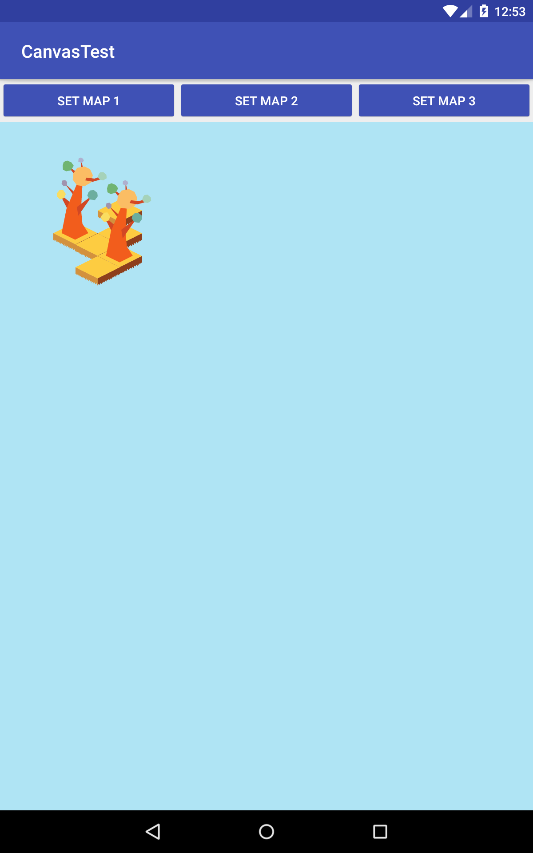

# CanvasTest

Test project to work with Canvas. 

## Implemented
- Construction of isometric map;
- Different types of blocks;
- Different types of objects;
- Selection and movement of objects on the map;
- Scaling and moving a "viewport".

## Screenshots

Map and tree :)

Another map and two tree.

Selecting an object.

Scaling and moving a "viewport".

Different types of blocks and objects.

Result of moving objects.

